<p align="center">
  
</p>

# Competências

- Realização de caso de uso
  - Consulta detalhada de produtos
  - Signup
  - Recuperação de senha
  - Obter usuário logado
- Consultas ao banco dados
- Envio de email com Gmail


# Tópicos


# Objetivo

Faremos alguns casos de uso em cima do projeto DSCatalog, envio de email, recuperação de senha e mais.

# UML

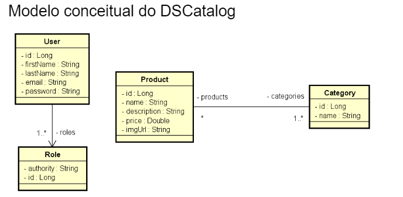

# Evitando consulta lenta (ManyToOne) - countQuery

## O que é?

Devemos tomar cuidados para que a nossa consulta não fique ineficiente (olhando os logs SQL).

Ineficiente por sua vez, entenda lento. Em virtude do comoportamento lazy (carregar de forma tardia) os objetos, 
devemos citar o seguinte: enquanto a sessão JPA estiver ATIVA, o acesso a um objeto associado (uma simples consulta) 
pode provocar várias consultas ao banco (voltando nele várias vezes).

Você pode ler mais sobre [aqui](https://olavo-moreira.gitbook.io/studies/v/jpa-consultas-sql-e-jpql/evitando-degradacao-de-performance-lentidao-jpa/analisando-o-carregamento-lazy-dos-funcionarios)

## Como resolver?

Usaremos uma cláusula da JPQL chamada Join Fetch.

Ao invés de usar aquele findAll padrão de sempre, criaremos um novo método no Repository.

O Join Fetch basicamente, força o Join a buscar o Product com as categorias associadas (mesmo com a tabela de associação).

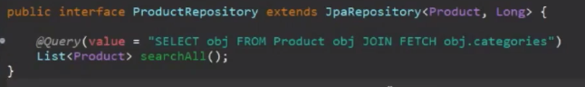

Mas a ideia é fazer corretamente com o Pageable, podemos passar ele também no searchAll (no controller/service).

A consulta é parecida, mas agora usamos countQuery (ele serve para dizer ao Spring, quantos elementos vamos buscar).
Usa o count no Obj e não usa o Fetch.


# Começando com casos de uso

## Consulta paginada de produtos

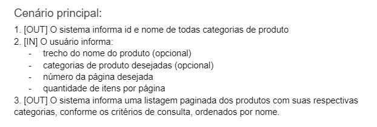

Uma requisição exemplo (o que usuário irá informar):``/products?page=0&size=12&name=ma&categoryId=1,3``

Faremos agora a consulta no Repository para que ele consiga encontrar as categorias e filtrar por nome. A ideia dessa
consulta é encontrar os IDS dos Produtos que vão fazer parte da página.

Depois que pegarmos esses Ids dos Produtos, usaremos ele de argumento na outra consulta, que encontrará os produtos com
as categorias.

Consulta feita no H2:

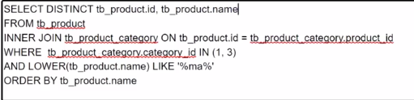

Agora iremos no Repository (Products), e criar o método searchProducts. Seus parâmetros serão exatamente o que está na
requisição (url) acima.

Além disso, retornará um Page do tipo ProductProjection.

O ProductProjection irá representar o retorno da consulta SQL feita no h2: id e name.

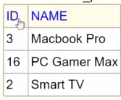

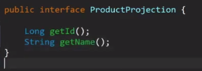

Passar o @Query no método com a consulta customizada. Se for consulta simples: JPQL, mais elaborada: SQL raíz.

Benefício da JPQL é que podemos instanciar a entidade monitorada pela JPA.

Já o SQL raíz, precisamos usar Projection (não monitorada).

Mas o controle que temos da consulta é 100% nosso (usando SQL raíz).

Como nesse caso temos DISTINCT, JOIN, condições de WHERE, usaremos a raíz.

Consulta para referência:
-

A única diferença, é que iremos renomear algumas coisas, passando os parâmetros.

Exemplo: ao invés de usar (1,3) para referenciar a ID das categorias, usaremos IN :categoryIds < parâmetro.

Outra coisa, como temos um pageable, precisamos usar o countQuery.

Como já temos o DISTINCT, no início faremos o SELECT COUNT(*) FROM (). E no final, como é uma subconsulta, usaremos o
AS tb_result.

```java
@Query(nativeQuery = true, value = """
	SELECT DISTINCT tb_product.id, tb_product.name
	FROM tb_product
	INNER JOIN tb_product_category ON tb_product_category.product_id = tb_product.id
	WHERE (:categoryIds IS NULL OR tb_product_category.category_id IN :categoryIds)
	AND (LOWER(tb_product.name) LIKE LOWER(CONCAT('%',:name,'%')))
	ORDER BY tb_product.name
	""",
	countQuery = """
	SELECT COUNT(*) FROM (
	SELECT DISTINCT tb_product.id, tb_product.name
	FROM tb_product
	INNER JOIN tb_product_category ON tb_product_category.product_id = tb_product.id
	WHERE (:categoryIds IS NULL OR tb_product_category.category_id IN :categoryIds)
	AND (LOWER(tb_product.name) LIKE LOWER(CONCAT('%',:name,'%')))
	) AS tb_result
	""")
Page<ProductProjection> searchProducts(List<Long> categoryIds, String name, Pageable pageable);

@Query("SELECT obj FROM Product obj JOIN FETCH obj.categories "
		+ "WHERE obj.id IN :productIds ORDER BY obj.name")
List<Product> searchProductsWithCategories(List<Long> productIds);
```

## Capturando parâmetros em requisição

Como podemos ver na requisição ali em cima, nós passamos alguns parâmetros (como name e categoryId). Como capturá-los?

Bom, dentro do método do Controller, iremos usar o @RequestParam com o seu valor.

## Repository

```java
@Repository
public interface ProductRepository extends JpaRepository<Product, Long> {

    @Query(nativeQuery = true, value = """
	SELECT DISTINCT tb_product.id, tb_product.name
	FROM tb_product
	INNER JOIN tb_product_category ON tb_product_category.product_id = tb_product.id
	WHERE (:categoryIds IS NULL OR tb_product_category.category_id IN :categoryIds)
	AND (LOWER(tb_product.name) LIKE LOWER(CONCAT('%',:name,'%')))
	ORDER BY tb_product.name
	""")
    Page<ProductProjection> searchProducts(List<Long> categoryIds, String name, Pageable pageable);

    @Query("SELECT obj FROM Product obj JOIN FETCH obj.categories "
    + "WHERE obj.id IN :productIds ORDER BY obj.name")
    List<Product> searchProductWithCategories(List<Long> productIds);
}
```


## Controller

```java
@GetMapping
public ResponseEntity<Page<ProductDTO>> findAll(
        @RequestParam(value = "name", defaultValue = "") String name,
        @RequestParam(value = "categoryId", defaultValue = "0") String categoryId,
        Pageable pageable) {
    Page<ProductDTO> list = service.findAllPaged(name, categoryId, pageable);
    return ResponseEntity.ok().body(list);
}
```

## Service

```java
@Transactional(readOnly = true)
public Page<ProductDTO> findAllPaged(String name, String categoryId, Pageable pageable) {
    //instanciando uma lista vazia de categoryId
    List<Long> categoryIds = Arrays.asList();
    //caso essa lista não tenha "0" (aquele parâmetro que passamos no controller),
    //iremos separar os números, e convertê-los para uma lista de Long
    if (!"0".equals(categoryIds)) {
        categoryIds = Arrays.asList(categoryId.split(",")).stream().map(Long::parseLong).toList();
    }

	//instanciaremos uma Page do tipo Projection, realizando a primeira consulta feita (em sql)
	Page<ProductProjection> page = repository.searchProducts(categoryIds, name, pageable);
	//pega a page acima, e mapeia ela para uma Lista do tipo Long (para inserirmos no segundo método do repository
	//(que fizemos em JPQL)
	List<Long> productIds = page.map(x -> x.getId()).toList();

    /* agora, criamos uma lista do tipo Product e utilizamos o método criado do repository (jpql)
    * visto que ele recebe como parâmetro uma lista de Long*/
	List<Product> entity = repository.searchProductWithCategories(productIds);
	//reconvertendo a lista do tipo Produto para uma do tipo DTO
	List<ProductDTO> dtos = entity.stream().map(x -> new ProductDTO(x, x.getCategories())).toList();

	//Agora, como não é para retornar uma lista e sim Page, instanciaremos uma passando: lista de dto, o get
	//pageable e o totalElements.
	Page<ProductDTO> pageDTO = new PageImpl<>(dtos, page.getPageable(), page.getTotalElements());

	return pageDTO;
}
```

## Quick fix: usando Sort do Pageable

Se você reparar nos métodos do Repository, estamos utilizando ORDER BY ao invés do Sort do pageable, isso não é o ideal.

Iremos arrumar isso em três passos:

1. Colocar alias de resultado em ambas as consultas SQL e remover os Order BY.

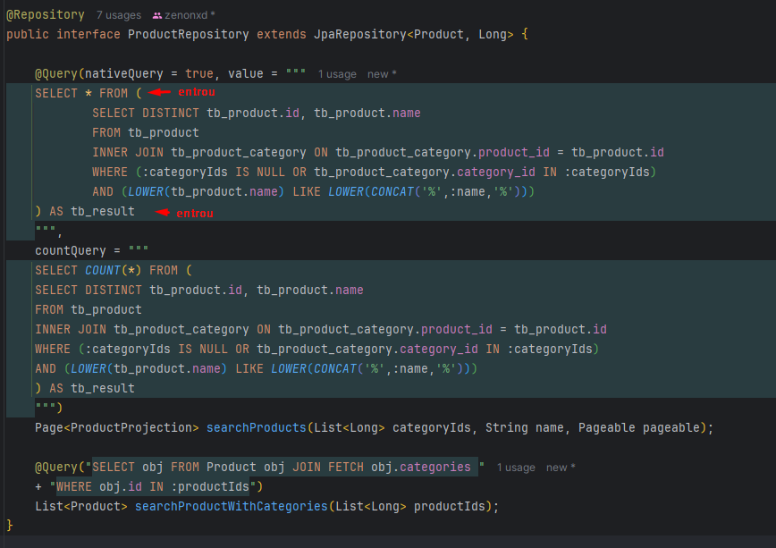

Com isso, ao realizarmos a requisição no Postman com sort por name, ele irá ordenar somente pelas páginas. Isso acontece
porque a nossa segunda consulta do repository, não tem "obrigação" de trazer os itens ordenados.

Ou seja, aquela list ali em cima de ProductProjection page, está ordenada. A de entities, não.

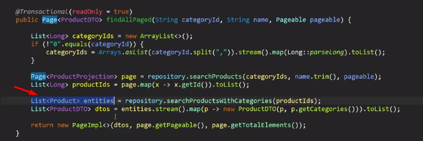

Lembrando, só podemos ordenar no momento por nome ou id, lembra da projection criada? (retorno da consulta SQL no h2)

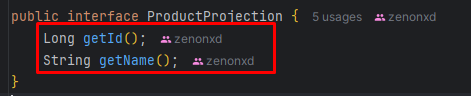

Se quiséssemos ordenar por preço, por exemplo, teria que ter um getPrice e mudar a consulta SQL.

Ok! Vamos resolver o problema do resultado desordenado nas páginas ➡️
<hr>

2. Resolver o problema do resultado desordenado 
   - Criar método estático auxiliar para gerar nova lista de entidades ordenada

Como sabemos que o "page" está ordenado, a ideia é criar um método para fazer o seguinte:

Iremos gerar uma nova lista, usando os objetos da lista não ordenada (entities), obedecendo à ordenação da ordenada
(page).

Criar um pacote util e a classe "utils". 

```java
public class Utils {

    //pegaremos a ordenação de projection (paginação) e montar uma nova lista de Product
    //usando como a base a lista desordenada (entity)
    public static List<Product> replace(List<ProductProjection> ordered, List<Product> unordered) {
        
        //Usar Map, pois é mais fácil para acessar os itens.
        //Long (para o id), guardaremos o product pelo ID.
        Map<Long, Product> map = new HashMap<>();

        //preenchendo o Map com os elementos da lista desordenada
        for (Product p : unordered) {
            map.put(p.getId(), p);
        }

        //criando lista de Produtos ordenada
        List<Product> result = new ArrayList<Product>();

        //agora, para cada Projection da ordered (lá em cima), iremos adicionar na result
        //o produto que corresponde a Projection
        for (ProductProjection p : ordered) {
            //irá para a lista, o produto que o id estiver no map, que tenha o ID do
            //objeto dentro da lista ordered
            result.add(map.get(p.getId()));
        }

        return result;
    }
}
```

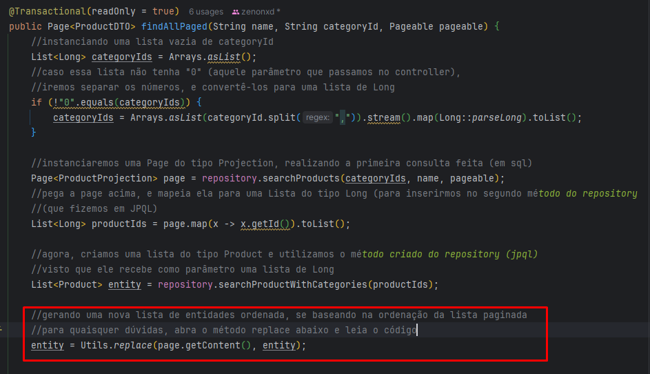

Ok, perfeito! A partir disso, poderemos fazer a requisição e virá em ordem alfabética ou por ID.

Só tem um porém. Fizemos a resolução se baseando num tipo de ProductProjection. E se fosse outro tipo? UserProjection e
User? Não tem porque reescrever o código. Deixaremos no próximo passo o método mais genérico ➡️

<hr>

3. Deixar a solução genérica (OO avançado)
   - Criar interface IdProjection<E>
   - Tipos Product e ProductProjection devem implementar IdProjection<E>
   - Refatorar o método auxiliar para que fique genérico

Bom, os dois parâmetros precisam ter ID, tanto a Projection quanto a Entidade:

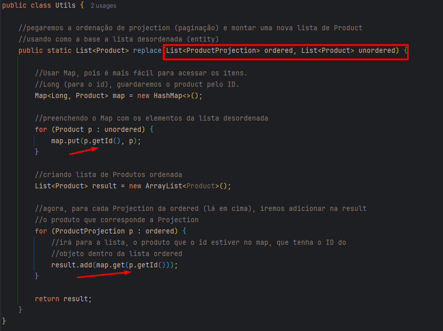

Para deixar isso genérico, criaremos uma interface que tenha o método getId.

No pacote interface criar: IdProjection

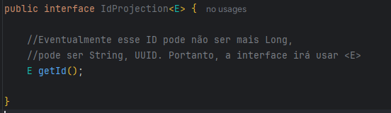

Agora, o nosso ProductProjection não terá mais um getId(). Ele irá herdar a interface acima.

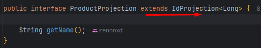

O Product é a mesma coisa, também irá herdar a interface (colocar @Override no getId para o compilador).

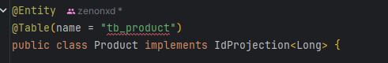

Voltando ao método replace, deixando ele genérico (usando tipo curinga).

Na nomeação do método, passaremos o tipo genérico <ID>. E não será mais uma lista de Product, e sim uma lista de
IdProjection<ID>. < Só isso, não iria funcionar, para que essa lista aceite como subtipo, uma lista de Produto,
iremos utilizar o tipo curinga (? extends).

O tipo curinga em suma diz: será uma lista de qualquer tipo (ou subtipo) de IdProjection. Como o Product implementa esse
IdProjection, ele é um subtipo de IdProjection (Long).

Ou seja, uma lista de Product, casa com uma Lista de IdProjection.

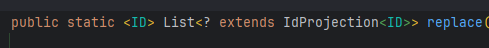

Copiaremos a mesma nomenclatura para os parâmetros:

Método alterado:

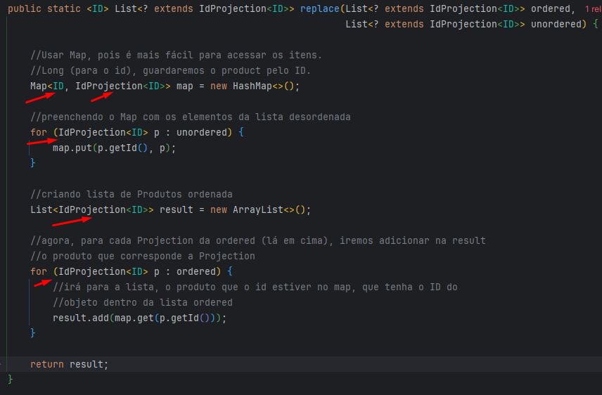

Service alterado (um simples casting):

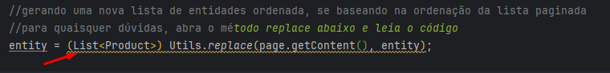