<p align="center">
  
</p>

# Competências

- Realização de caso de uso
  - Consulta detalhada de produtos
  - Signup
  - Recuperação de senha
  - Obter usuário logado
- Consultas ao banco dados
- Envio de email com Gmail


# Tópicos


# Objetivo

Faremos alguns casos de uso em cima do projeto DSCatalog, envio de email, recuperação de senha e mais.

# UML


# Evitando consulta lenta (ManyToOne) - countQuery

## O que é?

Devemos tomar cuidados para que a nossa consulta não fique ineficiente (olhando os logs SQL).

Ineficiente por sua vez, entenda lento. Em virtude do comoportamento lazy (carregar de forma tardia) os objetos, 
devemos citar o seguinte: enquanto a sessão JPA estiver ATIVA, o acesso a um objeto associado (uma simples consulta) 
pode provocar várias consultas ao banco (voltando nele várias vezes).

Você pode ler mais sobre [aqui](https://olavo-moreira.gitbook.io/studies/v/jpa-consultas-sql-e-jpql/evitando-degradacao-de-performance-lentidao-jpa/analisando-o-carregamento-lazy-dos-funcionarios)

## Como resolver?

Usaremos uma cláusula da JPQL chamada Join Fetch.

Ao invés de usar aquele findAll padrão de sempre, criaremos um novo método no Repository.

O Join Fetch basicamente, força o Join a buscar o Product com as categorias associadas (mesmo com a tabela de associação).


Mas a ideia é fazer corretamente com o Pageable, podemos passar ele também no searchAll (no controller/service).

A consulta é parecida, mas agora usamos countQuery (ele serve para dizer ao Spring, quantos elementos vamos buscar).
Usa o count no Obj e não usa o Fetch.


# Começando com casos de uso

## Consulta paginada de produtos


Uma requisição exemplo (o que usuário irá informar):``/products?page=0&size=12&name=ma&categoryId=1,3``

Faremos agora a consulta no Repository para que ele consiga encontrar as categorias e filtrar por nome. A ideia dessa
consulta é encontrar os IDS dos Produtos que vão fazer parte da página.

Depois que pegarmos esses Ids dos Produtos, usaremos ele de argumento na outra consulta, que encontrará os produtos com
as categorias.

Consulta feita no H2:


Agora iremos no Repository (Products), e criar o método searchProducts. Seus parâmetros serão exatamente o que está na
requisição (url) acima.

Além disso, retornará um Page do tipo ProductProjection.

O ProductProjection irá representar o retorno da consulta SQL feita no h2: id e name.


Passar o @Query no método com a consulta customizada. Se for consulta simples: JPQL, mais elaborada: SQL raíz.

Benefício da JPQL é que podemos instanciar a entidade monitorada pela JPA.

Já o SQL raíz, precisamos usar Projection (não monitorada).

Mas o controle que temos da consulta é 100% nosso (usando SQL raíz).

Como nesse caso temos DISTINCT, JOIN, condições de WHERE, usaremos a raíz.

Consulta para referência:
-

A única diferença, é que iremos renomear algumas coisas, passando os parâmetros.

Exemplo: ao invés de usar (1,3) para referenciar a ID das categorias, usaremos IN :categoryIds < parâmetro.

Outra coisa, como temos um pageable, precisamos usar o countQuery.

Como já temos o DISTINCT, no início faremos o SELECT COUNT(*) FROM (). E no final, como é uma subconsulta, usaremos o
AS tb_result.

```java
@Query(nativeQuery = true, value = """
	SELECT DISTINCT tb_product.id, tb_product.name
	FROM tb_product
	INNER JOIN tb_product_category ON tb_product_category.product_id = tb_product.id
	WHERE (:categoryIds IS NULL OR tb_product_category.category_id IN :categoryIds)
	AND (LOWER(tb_product.name) LIKE LOWER(CONCAT('%',:name,'%')))
	ORDER BY tb_product.name
	""",
	countQuery = """
	SELECT COUNT(*) FROM (
	SELECT DISTINCT tb_product.id, tb_product.name
	FROM tb_product
	INNER JOIN tb_product_category ON tb_product_category.product_id = tb_product.id
	WHERE (:categoryIds IS NULL OR tb_product_category.category_id IN :categoryIds)
	AND (LOWER(tb_product.name) LIKE LOWER(CONCAT('%',:name,'%')))
	) AS tb_result
	""")
Page<ProductProjection> searchProducts(List<Long> categoryIds, String name, Pageable pageable);

@Query("SELECT obj FROM Product obj JOIN FETCH obj.categories "
		+ "WHERE obj.id IN :productIds ORDER BY obj.name")
List<Product> searchProductsWithCategories(List<Long> productIds);
```

## Capturando parâmetros em requisição

Como podemos ver na requisição ali em cima, nós passamos alguns parâmetros (como name e categoryId). Como capturá-los?

Bom, dentro do método do Controller, iremos usar o @RequestParam com o seu valor.

## Repository

```java
@Repository
public interface ProductRepository extends JpaRepository<Product, Long> {

    @Query(nativeQuery = true, value = """
	SELECT DISTINCT tb_product.id, tb_product.name
	FROM tb_product
	INNER JOIN tb_product_category ON tb_product_category.product_id = tb_product.id
	WHERE (:categoryIds IS NULL OR tb_product_category.category_id IN :categoryIds)
	AND (LOWER(tb_product.name) LIKE LOWER(CONCAT('%',:name,'%')))
	ORDER BY tb_product.name
	""")
    Page<ProductProjection> searchProducts(List<Long> categoryIds, String name, Pageable pageable);

    @Query("SELECT obj FROM Product obj JOIN FETCH obj.categories "
    + "WHERE obj.id IN :productIds ORDER BY obj.name")
    List<Product> searchProductWithCategories(List<Long> productIds);
}
```


## Controller

```java
@GetMapping
public ResponseEntity<Page<ProductDTO>> findAll(
        @RequestParam(value = "name", defaultValue = "") String name,
        @RequestParam(value = "categoryId", defaultValue = "0") String categoryId,
        Pageable pageable) {
    Page<ProductDTO> list = service.findAllPaged(name, categoryId, pageable);
    return ResponseEntity.ok().body(list);
}
```

## Service

```java
@Transactional(readOnly = true)
public Page<ProductDTO> findAllPaged(String name, String categoryId, Pageable pageable) {
    //instanciando uma lista vazia de categoryId
    List<Long> categoryIds = Arrays.asList();
    //caso essa lista não tenha "0" (aquele parâmetro que passamos no controller),
    //iremos separar os números, e convertê-los para uma lista de Long
    if (!"0".equals(categoryIds)) {
        categoryIds = Arrays.asList(categoryId.split(",")).stream().map(Long::parseLong).toList();
    }

	//instanciaremos uma Page do tipo Projection, realizando a primeira consulta feita (em sql)
	Page<ProductProjection> page = repository.searchProducts(categoryIds, name, pageable);
	//pega a page acima, e mapeia ela para uma Lista do tipo Long (para inserirmos no segundo método do repository
	//(que fizemos em JPQL)
	List<Long> productIds = page.map(x -> x.getId()).toList();

    /* agora, criamos uma lista do tipo Product e utilizamos o método criado do repository (jpql)
    * visto que ele recebe como parâmetro uma lista de Long*/
	List<Product> entity = repository.searchProductWithCategories(productIds);
	//reconvertendo a lista do tipo Produto para uma do tipo DTO
	List<ProductDTO> dtos = entity.stream().map(x -> new ProductDTO(x, x.getCategories())).toList();

	//Agora, como não é para retornar uma lista e sim Page, instanciaremos uma passando: lista de dto, o get
	//pageable e o totalElements.
	Page<ProductDTO> pageDTO = new PageImpl<>(dtos, page.getPageable(), page.getTotalElements());

	return pageDTO;
}
```

## Quick fix: usando Sort do Pageable

Se você reparar nos métodos do Repository, estamos utilizando ORDER BY ao invés do Sort do pageable, isso não é o ideal.

Iremos arrumar isso em três passos:

1. Colocar alias de resultado em ambas as consultas SQL e remover os Order BY.


Com isso, ao realizarmos a requisição no Postman com sort por name, ele irá ordenar somente pelas páginas. Isso acontece
porque a nossa segunda consulta do repository, não tem "obrigação" de trazer os itens ordenados.

Ou seja, aquela list ali em cima de ProductProjection page, está ordenada. A de entities, não.


Lembrando, só podemos ordenar no momento por nome ou id, lembra da projection criada? (retorno da consulta SQL no h2)


Se quiséssemos ordenar por preço, por exemplo, teria que ter um getPrice e mudar a consulta SQL.

Ok! Vamos resolver o problema do resultado desordenado nas páginas ➡️
<hr>

2. Resolver o problema do resultado desordenado 
   - Criar método estático auxiliar para gerar nova lista de entidades ordenada

Como sabemos que o "page" está ordenado, a ideia é criar um método para fazer o seguinte:

Iremos gerar uma nova lista, usando os objetos da lista não ordenada (entities), obedecendo à ordenação da ordenada
(page).

Criar um pacote util e a classe "utils". 

```java
public class Utils {

    //pegaremos a ordenação de projection (paginação) e montar uma nova lista de Product
    //usando como a base a lista desordenada (entity)
    public static List<Product> replace(List<ProductProjection> ordered, List<Product> unordered) {
        
        //Usar Map, pois é mais fácil para acessar os itens.
        //Long (para o id), guardaremos o product pelo ID.
        Map<Long, Product> map = new HashMap<>();

        //preenchendo o Map com os elementos da lista desordenada
        for (Product p : unordered) {
            map.put(p.getId(), p);
        }

        //criando lista de Produtos ordenada
        List<Product> result = new ArrayList<Product>();

        //agora, para cada Projection da ordered (lá em cima), iremos adicionar na result
        //o produto que corresponde a Projection
        for (ProductProjection p : ordered) {
            //irá para a lista, o produto que o id estiver no map, que tenha o ID do
            //objeto dentro da lista ordered
            result.add(map.get(p.getId()));
        }

        return result;
    }
}
```


Ok, perfeito! A partir disso, poderemos fazer a requisição e virá em ordem alfabética ou por ID.

Só tem um porém. Fizemos a resolução se baseando num tipo de ProductProjection. E se fosse outro tipo? UserProjection e
User? Não tem porque reescrever o código. Deixaremos no próximo passo o método mais genérico ➡️

<hr>

3. Deixar a solução genérica (OO avançado)
   - Criar interface IdProjection<E>
   - Tipos Product e ProductProjection devem implementar IdProjection<E>
   - Refatorar o método auxiliar para que fique genérico

Bom, os dois parâmetros precisam ter ID, tanto a Projection quanto a Entidade:


Para deixar isso genérico, criaremos uma interface que tenha o método getId.

No pacote interface criar: IdProjection


Agora, o nosso ProductProjection não terá mais um getId(). Ele irá herdar a interface acima.


O Product é a mesma coisa, também irá herdar a interface (colocar @Override no getId para o compilador).


Voltando ao método replace, deixando ele genérico (usando tipo curinga).

Na nomeação do método, passaremos o tipo genérico <ID>. E não será mais uma lista de Product, e sim uma lista de
IdProjection<ID>. < Só isso, não iria funcionar, para que essa lista aceite como subtipo, uma lista de Produto,
iremos utilizar o tipo curinga (? extends).

O tipo curinga em suma diz: será uma lista de qualquer tipo (ou subtipo) de IdProjection. Como o Product implementa esse
IdProjection, ele é um subtipo de IdProjection (Long).

Ou seja, uma lista de Product, casa com uma Lista de IdProjection.


Copiaremos a mesma nomenclatura para os parâmetros:

Método alterado:


Service alterado (um simples casting):


## Incluir Postgres no perfil dev

Como a consulta acima foi bem complexa, é importante que a gente valide essa consulta, para ver se ela também funciona
em um banco de dados real (nuvem), como o Postgres.

Colocar Maven do Postgres.

Arquivo application-dev.properties:

```properties
#spring.jpa.properties.jakarta.persistence.schema-generation.create-source=metadata
#spring.jpa.properties.jakarta.persistence.schema-generation.scripts.action=create
#spring.jpa.properties.jakarta.persistence.schema-generation.scripts.create-target=create.sql
#spring.jpa.properties.hibernate.hbm2ddl.delimiter=;

spring.datasource.url=jdbc:postgresql://localhost:5433/dscatalog
spring.datasource.username=postgres
spring.datasource.password=1234567

spring.jpa.database-platform=org.hibernate.dialect.PostgreSQLDialect
spring.jpa.properties.hibernate.jdbc.lob.non_contextual_creation=true
spring.jpa.hibernate.ddl-auto=none
```

## Executando o Postgres e pgAdmin com Docker Compose

Executar Postgresql e pgAdmin (ou DBeaver)
Opção 1: instalar diretamente o Postgresql e o pgAdmin ou DBeaver no seu sistema

Opção 2: subir Postgresql e pgAdmin via Docker Compose:
https://gist.github.com/acenelio/5e40b27cfc40151e36beec1e27c4ff71

## Criando script SQL da base de dados e testando consulta

Criar uma database denominada "dscatalog", igual no app-dev ali em cima.

Tirar os comentários daquelas 4 primeiras linhas, rodar a aplicação para criar o Script de criação das tabelas.

No postgres, joga o script lá.

## Dica drop table em todas tabelas

Dica: gerar comandos SQL para excluir tabelas

```postgresql
SELECT 'drop table if exists ' || tablename || ' cascade;'
FROM pg_tables
WHERE schemaname = 'public';
```

Ao rodar esse código no pgAdmin, ele nos retorna os drop tables de TODAS as tabelas e você pode selecionar a que
preferir:

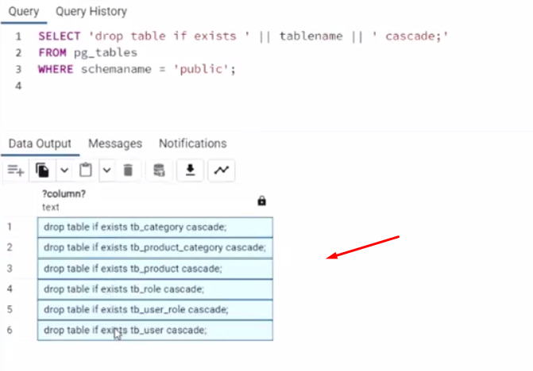

## Caso de uso - signup

Cadastro de usuário no sistema.

### Cenário principal:
1. [IN] O usuário informa primeiro nome, sobrenome, e-mail e senha

### Exceção 1.1: Erro de validação
2. [OUT] O sistema informa os erros de validação

### Informações complementares

Critérios de validação de usuário
- Nome: campo requerido
- E-mail: e-mail válido
- Senha: mínimo 8 caracteres

Primeira coisa é retirar o @PreAuthorize de Admin para que qualquer pessoa possa se registrar.

Na requisição Postman, retirar a lista de roles que é passada, afinal ele vai ser gerada automaticamente pelo backend.

No UserInsertDTO, passar @NotBlank, @Size na password.

No service, precisamos settar a role no insert, mas antes disso, depois de usar o copy, dar clear, veja:

```java
	@Transactional
	public UserDTO insert(UserInsertDTO dto) {
		User entity = new User();
		copyDtoToEntity(dto, entity);

		//clear
		entity.getRoles().clear();
		//settando role manualmente, usando repository
		Role role = roleRepository.findByAuthority("ROLE_OPERATOR");
		entity.getRoles().add(role);

		entity.setPassword(passwordEncoder.encode(dto.getPassword()));

		entity = repository.save(entity);

		return new UserDTO(entity);
	}
```

Fazer a requisição no Postman:

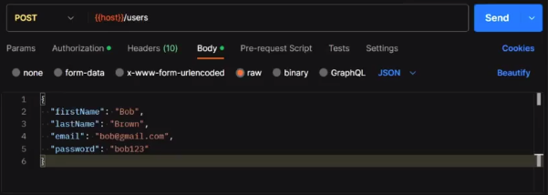

## Configurando senha de app do Gmail (iniciando recuperação de senha)

A ideia é enviar e-mail para o usuário, para fazermos isso, precisamos de um provedor, usaremos o SMTP do gmail.

Envio de e-mail via Gmail
1. Criar uma senha de app na sua conta do Google
   Guia:
   https://support.google.com/accounts/answer/185833

Acessar a sua conta no Google ⇒ Segurança ⇒ Validação em duas etapas ⇒ Senhas de app
https://myaccount.google.com/

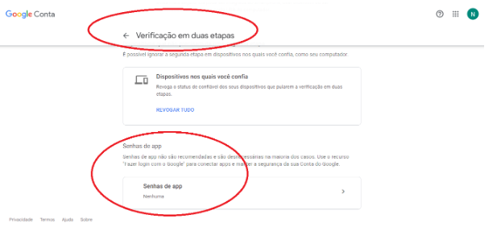

Selecionar dispositivo ⇒ Outro ⇒ (escolha um nome que lembre o seu app) ⇒ Gerar

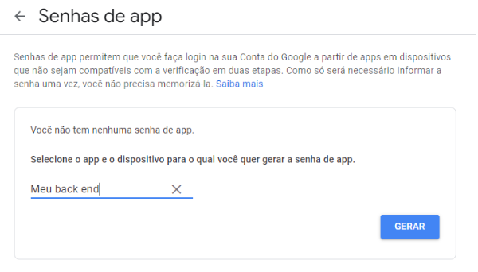

Pronto! Sua senha de app de 16 caracteres foi gerada. Salve-a em um lugar seguro.

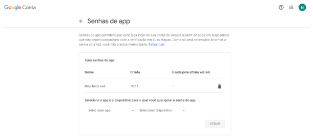

2. Agora, vá [neste repositório](https://github.com/devsuperior/spring-boot-gmail), e copie as variáveis de ambiente do
application.properties e insira no projeto.

**❗ATENÇÃO**: nunca escreva as suas credenciais diretamente no application.properties. Configure os valores das variáveis no 
ambiente de execução do projeto.

O e-mail na variável de ambiente é o nosso pessoal mesmo (do gmail), a senha é a criada acima.

3. Execute o projeto e teste a requisição de envio de e-mail

POST http://localhost:8080/email

Corpo da requisição:

```json
{
    "to": "destinatario@gmail.com",
    "subject": "Aviso aos clientes",
    "body": "Prezado cliente,\n\nAcesse agora:\n\nhttps://devsuperior.com.br\n\nAbraços!"
}
```

## Enviando e-mail com projeto referência

Dá um clone no repositório acima, abrindo na IDE e settando as variáveis de ambiente novamente. NÃO AS PASSE NO 
application.properties.

Use a requisição postman acima.

## Explicando a requisição feita

Se você olhar na estrutura do projeto acima, temos:

EmailController, com a função sendEmail, recebendo um EmailDTO (retorna noContent e void).

EmailDTO, obviamente, possui a estrutura da requisição Postman acima com as anotações @Email, @NotBlank.

No service, temos a função recebendo um EmailDTO fazendo um try-catch.

O bacana do service é que ele pega o username do properties:

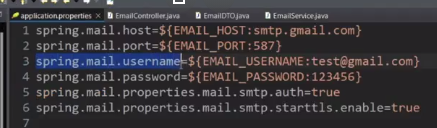

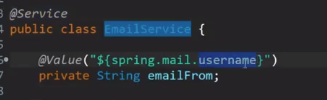

Depois, injetamos o componente chamado JavaMailSender (da biblioteca spring mail). Esse JavaMailSender, pega as
configurações do properties também: port, host, etc.

```java
@Service
public class EmailService {
	
	@Value("${spring.mail.username}")
	private String emailFrom;
	
    @Autowired
    private JavaMailSender emailSender;

    public void sendEmail(EmailDTO obj) {
        try{
            //esse simplemail é um objeto da lib do spring mail
            SimpleMailMessage message = new SimpleMailMessage();
            //agora é só settar o message
            //remetente
            message.setFrom(emailFrom);
            //destinatário
            message.setTo(obj.getTo());
            //assunto
            message.setSubject(obj.getSubject());
            //corpo mensagem
            message.setText(obj.getBody());
            emailSender.send(message);
        } 
        //essa exception foi criada customizada no pacote do service
        catch (MailException e){
        	throw new EmailException("Failed to send email");
        } 
    }
}
```

Destacando que tem que criar também o ExceptionHandler no pacote do Controller para tratar essa exceção acima.

## Caso de uso recuperação de senha

Cenário principal:
1. [IN] O usuário informa o seu email
2. [OUT] O sistema informa o token de recuperação e a validade do mesmo
3. [IN] O usuário informa o token de recuperação e a nova senha

Exceção 1.1: Email inválido
1.1.1. [OUT] O sistema informa que o email é inválido
<hr>

Exceção 1.2: Email não encontrado
1.2.1. [OUT] O sistema informa que o email não foi encontrado
<hr>

Exceção 3.1: Token inválido
3.1.1. [OUT] O sistema informa que o token é inválido
<hr>

Exceção 3.2: Erro de validação
3.1.2. [OUT] O sistema informa que a senha é inválida
<hr>

Primeira coisa, criar uma requisição POST, usaremos a URL "/auth/recover-token". Ou seja, teremos que criar um Controller
"AuthController".

No corpo da requisição, só teremos o email.

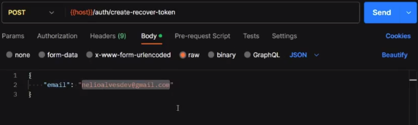

Para que o email da requisição funcione, o email utilizado na requisição deve ser inserido no banco de dados 
(import.sql), com role operator.

### AuthController (validando email)

Essa requisição retornará Void, no corpo da requisição passaremos um EmailDTO denominado "body" que possuirá somente
String email com as anotações. 

Criaremos um AuthService, com o método "createRecoverToken", passando o email.

A função do controller retornará um ``noContent().build``.

### AuthService (lógica envio email)

Bom, vamos pensar na lógica deste método.

1. Como está acima, precisamos verificar se o email existe. Se não encontrar, já retornar um 404.
2. Gerar um token com uma validade de X minutos e salvar no banco de dados (para o backend verificar se o token ainda é
valido).
3. Enviar o email para o usuário com um link para usar o token.

⬆️ Tudo isso é só para o primeiro passo do caso de uso: **1. [IN] O usuário informa o seu email**

### PASSO 1 

Para verificar se o usuário existe, precisamos instanciar um usuário e injetar o UserRepository (findByEmail), lembra?

Se o user for nulo, lançar ResourceNotFoundException.

### PASSO 2

A partir do momento que precisamos salvar algo no banco, precisamos criar uma entidade. Vamos criar uma classe chamada
"PasswordRecover", fazer as suas anotações para virar uma table.

Ela terá ID e um token do tipo String, um String email e o tempo de expiração do tipo Instant. ⬅️ Todos esses campos são
**obrigatórios**.

Colocar getters and setters + hashcode&equals com a ID.

Voltamos no service para continuar a lógica! Criaremos um objeto do tipo PasswordRecover. A partir disso, settaremos
os seus atributos.

O email, será o que veio do DTO. 

O token criaremos um do tipo ``UUID.randomUUID().toString``.

A expiração será Instant.now().plus(tempo que queremos). Esse tempo, virá das variáveis que estarão no application.properties
⬇️.

#### Variáveis para recuperação de senha

```properties
email.password-recover.token.minutes=${PASSWORD_RECOVER_TOKEN_MINUTES:30}
email.password-recover.uri=${PASSWORD_RECOVER_URI:http://localhost:5173/recover-password/}
```

Essa URI é o endereço que chegará no email do usuário, o endereço do frontend fica no lugar do localhost.

Para ler a variável do token.minutes, só injetar ela no service com @Value:

```java
@Value("${email.password-recover.token.minutes}")
private Long tokenMinutes;
```

Inserir isso dentro do ".plus()" ⬆️ (se não tiver minutos, multiplicar por 60L).

Para salvarmos no banco de dados, criar um repository para o PasswordRecover.

### PASSO 3

Para fazermos o envio do email, iremos utilizar o EmailService (injetaremos ele no AuthService).

Usaremos o método ``.sendEmail(to, subject, body)``. O to, é para o DTO, subject será "recuperação de senha" e o body,
faremos o seguinte:

Podemos criar uma String text com o corpo da mensagem a ser passada ``"Acesse o link para definir uma nova senha\n\n" +
link + token + ". Validade de " + tokenMinutes + " minutos";``, inserindo depois no parâmetro acima ⬆️.

Qual link? O recover.uri ali de cima do properties. Só injetar exatamente como o token! E para ficar mais fácil, podemos
criar uma variável para o token também.

E para que a gente entenda: essa tela de "nova senha", o frontend conhece esse token gerado (UUID).

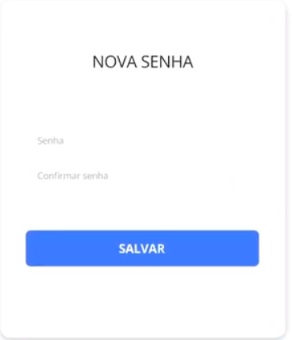

### PASSO 4 - EmailException

Fazer o tratamento no ControllerExceptionHandler. 

Vai retornar um bad request.

## Salvando uma nova senha caso o token seja válido

O usuário vai entrar na tela de nova senha e digitar ela e o backend vai conferir se o token ainda é valido.

### Consulta para encontrar o token não expirado

Utilizaremos ela no PasswordRecoverRepository.

```java
@Query("SELECT obj FROM PasswordRecover obj WHERE obj.token = :token AND obj.expiration > :now")
List<PasswordRecover> searchValidTokens(String token, Instant now);
```

<hr>

No AuthController, criaremos um PUT (afinal, iremos inserir uma nova senha). 

1. A URL será "/new-password"
2. Retornará Void
3. O método criado (para o service) será "saveNewPassword"
3. @Valid e @RequestBody, passando um NewPasswordDTO (terá somente um String token e String password com critério de
validação), veja:

#### Critérios de validação de senha: 

Mínimo 8 caracteres e @NotBlank.
<hr>

No service, criar o método com Transactional e fazer a lógica, primeiro verificando se o token está expirado.

Se a lista que retornará do repository for igual a zero, lançaremos a exceção ResourceNotFoundException.

Se o token for válido, salvaremos a senha no banco.

O que vem de resultado nessa lista (advinda do PasswordRecover), ela possui como atributo o email do usuário, então
faremos o seguinte:

1. Instanciaremos um usuário, e no ``result.get(0)`` (o primeiro token que chegou), podemos acessar o atributo com
``.getEmail()``
2. Alocaremos isso em um findByEmail do userRepository
3. Pegaremos o usuário e daremos um ``setPassword``, atualizando a sua senha. Como a senha é tem a criptografia,
injetaremos o BCrypt (PasswordEncoder) lá em cima
4. Após isso, usar o ``save``.

Para testar, só passar o NewPasswordDTO na URL "/auth/new-password" com o token + password. O token é o recoverToken
(UUID) que chegará no email.


### Obter usuário logado

#### AuthService

```java
protected User authenticated() {
  try {
    Authentication authentication = SecurityContextHolder.getContext().getAuthentication();
    Jwt jwtPrincipal = (Jwt) authentication.getPrincipal();
    String username = jwtPrincipal.getClaim("username");
    return userRepository.findByEmail(username);
  }
  catch (Exception e) {
    throw new UsernameNotFoundException("Invalid user");
  }
}
```

#### UserService

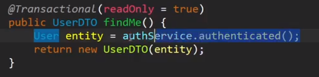


#### UserController

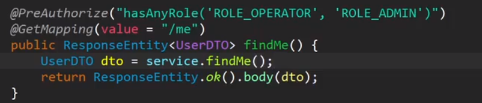

#### Postman

Tem que ter bearerToken.

``GET {{host}}/users/me``

## Desafio Movieflix


